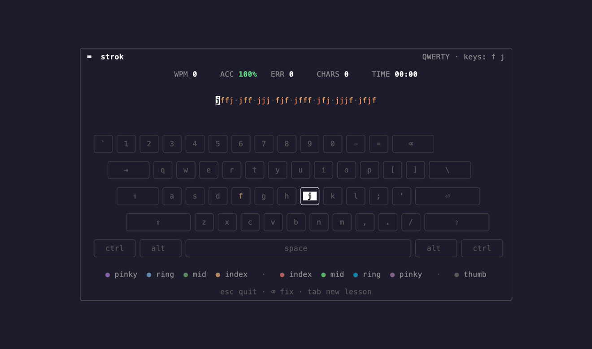

# strok

A terminal-based typing app for developers.

`strok` always shows a full, finger-colored keyboard, gives live per-character
feedback, and grows the alphabet you practice as you improve — all in a single,
dependency-free binary.



## Features

- **Always-visible keyboard** with every key mapped to a finger and color-coded
  by finger (9 colors), plus a **finger-color legend** beneath it so you can tell
  which color means which finger.
- **Finger-colored text**: upcoming characters are tinted by the finger that
  types them, so you know which finger to use before you press. Already-typed
  characters stay green (correct) or red (wrong).
- **Live feedback**: the current key is highlighted; a correct press flashes
  green, a wrong press turns the expected key yellow and the pressed key red.
- **Live stats**: WPM, accuracy, errors, characters typed, elapsed time.
- **Progressive lessons**: drill-style practice that starts with `f`/`j` and
  widens the alphabet as you advance.
- **Local persistence**: progress (best/avg WPM, accuracy, practice time,
  completed lessons, weak keys) is saved as JSON.
- **Resize-safe** and works on Linux, macOS, and Windows.

## Install & run

Requires Go 1.22+.

```bash
go run ./cmd/strok
```

Or build a binary:

```bash
go build -o strok ./cmd/strok
./strok
```

### Flags

| Flag | Description |
|------|-------------|
| `--data <path>` | Override the profile JSON location (default: OS config dir, e.g. `~/.config/strok/profile.json`). |

## Controls

| Key | Action |
|-----|--------|
| letters / space | type the current character |
| `backspace` | correct the visible text (errors stay counted) |
| `tab` | restart the current lesson |
| `esc` / `ctrl+c` | save and quit |

Backspace lets you fix the text you see, but every wrong keystroke permanently
counts against your accuracy.

## Architecture

`strok` is layered so the typing logic is fully decoupled from the terminal UI
and unit-tested without a terminal.

```
cmd/strok            wiring / lifecycle
internal/ui          Bubble Tea Model (orchestration only)
internal/engine      typing state machine (pure)
internal/stats       WPM / accuracy math (pure)
internal/keyboard    layout + finger map
internal/lesson      pluggable lesson generator
internal/storage     JSON persistence
internal/domain      pure data types, no dependencies
```

Four interfaces — `lesson.Generator`, `storage.Store`, `keyboard.Layout`, and
`ui.Clock` — are the seams that make future features (adaptive lessons, new
layouts, themes, heatmaps, multiplayer) additive rather than invasive. See
[`docs/DESIGN.md`](docs/DESIGN.md) for the full design.

## Development

```bash
make build   # build the binary
make test    # run the test suite
make run     # build and run
make vet     # go vet
```

### Regenerating the demo GIF

The README GIF is recorded with [vhs](https://github.com/charmbracelet/vhs)
from a checked-in tape. `cmd/demorec` is a throwaway harness that runs the real
UI with a fixed-seed generator, so the demo lesson is deterministic and the
recorded run is always all-green:

```bash
vhs docs/demo.tape   # rewrites docs/demo.gif
```

## License

MIT — see [LICENSE](LICENSE).
